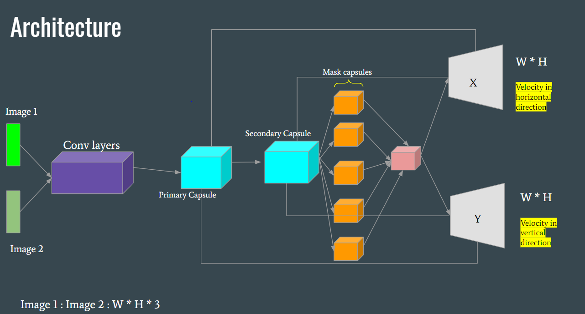

# CapsFlow-Optical-Flow-Estimation-with-Capsule-Networks
Code for my paper CapsFlow: Optical Flow Estimation with Capsule Networks (which didn't get published :( )
=============

**Architechure for the model**

-------------

**Dependencies**
1. Pytorch
2. TensorboardX
3. PIL
4. skimage

-------------

**How to Run**

1. `python main.py` (without any arguments) will run start training the model for shape dataset, the dataset is generated at runtime from `data_shape_double.py`. For more information on shape dataset refer to https://github.com/RahulSChand/Optical-Flow-Shape-Dataset
2. For training the model on flying chairs dataset or for if you want to use flying chairs dataset for your own pytorch model you can refer to `flying_chairs_dataset.py`

-------------

**Results**

For shape dataset

Ground truth

Prediction

-------------

Ground truth

Prediction

